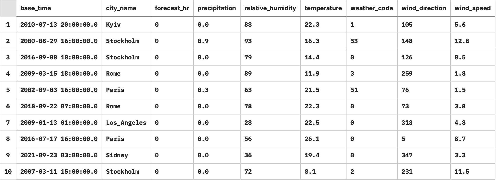
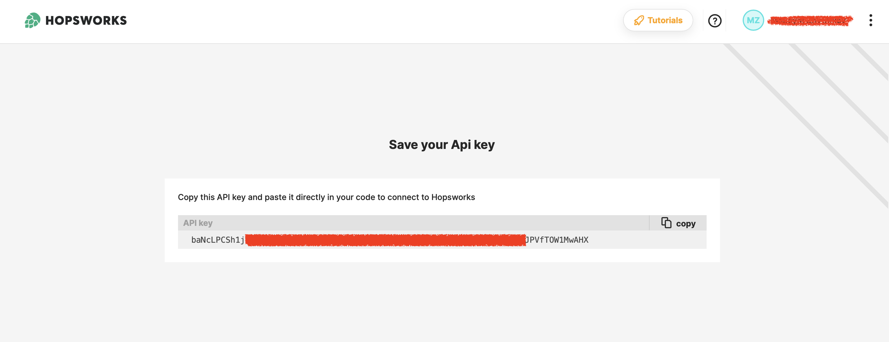
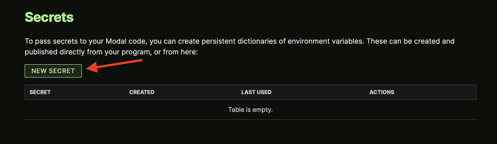
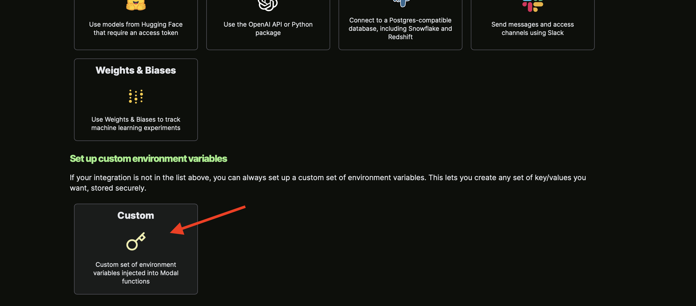
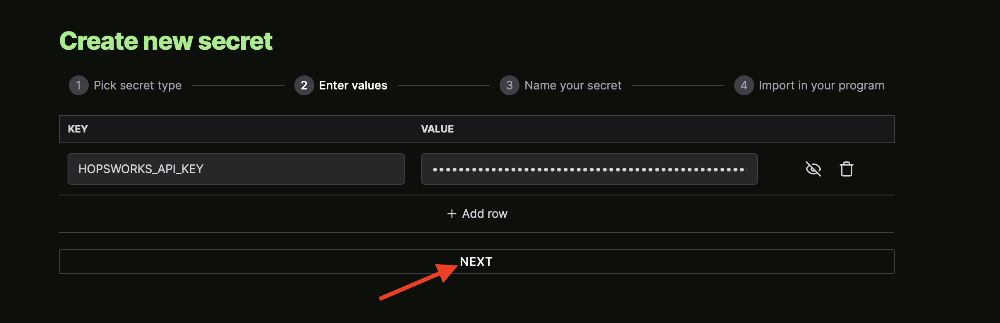
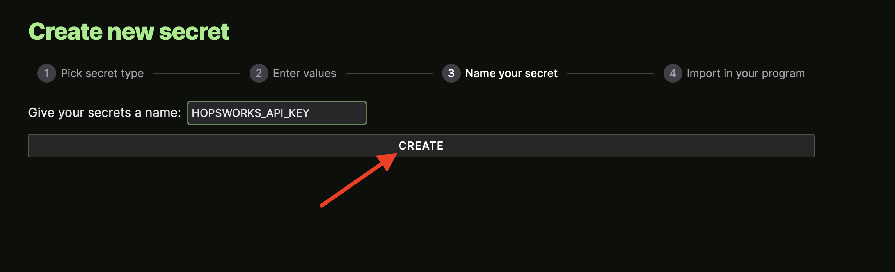

# <span style="color:#ff5f27">🌦️ Public Weather Feature Group</span>

Historical weather data from **2000-01-01 00:00:00** for the next cities:
- London
- Paris
- Stockholm
- New York
- Los Angeles
- Singapore
- Sydney
- Hong Kong
- Rome
- Kyiv


# 🧙🏼‍♂️ Method of obtaining data
Requests using API from [open-meteo](https://open-meteo.com).


# 👨🏻‍🏫 Data Sample



# 🗓️ Scheduling
To schedule a Feature Pipeline we are using [modal](https://modal.com/home).

## ⚙️ Modal Set Up
1. [Sign up](https://modal.com/signup) with your GitHub.

2. Download and configure the Python client.
```
pip install modal-client
modal token new
```

3. [Set up](https://modal.com/secrets) Hopsworks API Key.

`HOPSWORKS_API_KEY`







## 🚀 Run Modal Pipeline
Use the next command to run Modal pipeline ⬇️

`modal run pipeline_public_weather_fg.py`

You can find your Modal App [here](https://modal.com/apps).
