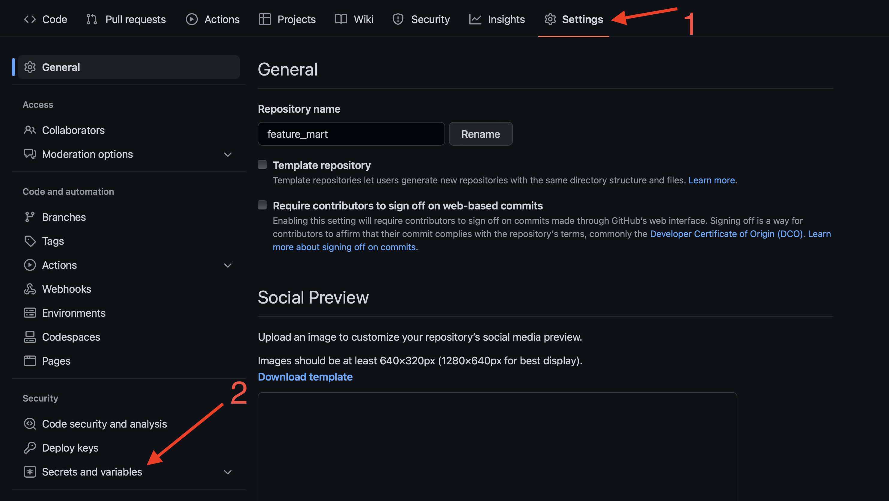
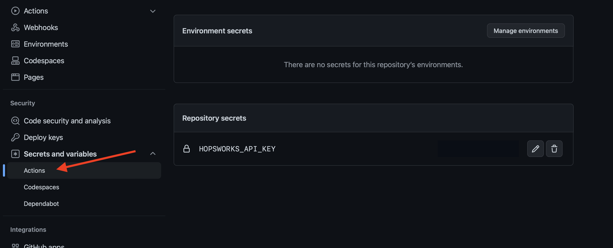
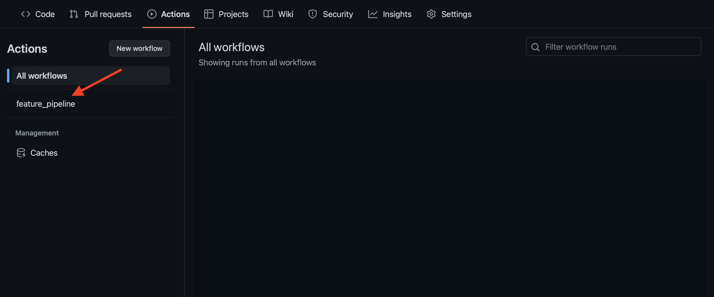
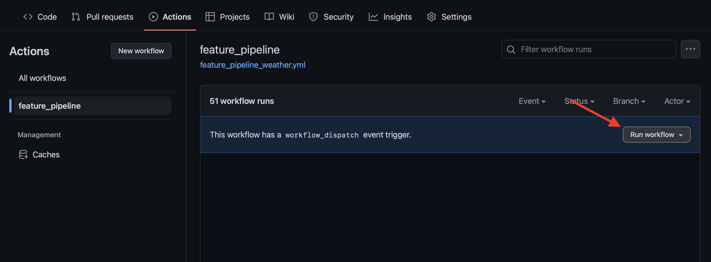

# 🌦️ Public Weather Feature Group

Historical weather data from **2000-01-01 00:00:00** for the next cities:
- London
- Paris
- Stockholm
- New York
- Los Angeles
- Singapore
- Sydney
- Hong Kong
- Rome
- Kyiv

# 🧙🏼‍♂️ Method of obtaining data
Requests using API from [open-meteo](https://open-meteo.com).

# 👨🏻‍🏫 Data Sample

# 🗓️ Scheduling
To schedule a Feature Pipeline we are using [GitHub Actions](https://github.com/features/actions).

## ⚙️ GitHub Actions Set Up
1. `feature_pipeline_weather.yml` will set up a workflow for you. It will run every day at 00:00.

2. Get your Hopsworks API Key.

`HOPSWORKS_API_KEY`

---
3. Add your `HOPSWORKS_API_KEY` to **Actions secrets and variables**.

---
4. Besides scheduling, you can run your workflow manually.

